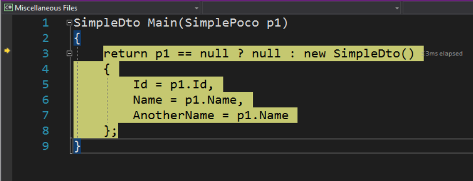

# 调试映射

### 步进调试

> 这个插件允许使用Roslyn执行步进调试！

> 步进调试就是默认 F11 快捷键的调试

    PM> Install-Package ExpressionDebugger

##### 如何使用

在启动时或编译映射之前的任何地方添加以下代码：

```csharp
TypeAdapterConfig.GlobalSettings.Compiler = exp => exp.CompileWithDebugInfo();
```

现在处于 DEBUG 模式时，可以步进调试映射代码：

```csharp
var dto = poco.Adapt<SimplePoco, SimpleDto>(); //<--- 你可以步进调试到这段代码中
```



##### 使用内部类或成员

调试模式不支持  `private` 、`protected` 、`internal`

### 查看映射逻辑

通过 `ToScript` 方法可以查看 Mapster 生成的映射逻辑：

```
var script = poco.BuildAdapter()
                .CreateMapExpression<SimpleDto>()
                .ToScript();
```

### 在Visual Studio for Mac中调试映射
在 Visual Studio for Mac 中进行步进映射调试，需要配置 `EmitFile` 为 `true`：

```csharp
var opt = new ExpressionCompilationOptions { EmitFile = true };
TypeAdapterConfig.GlobalSettings.Compiler = exp => exp.CompileWithDebugInfo(opt);
...
var dto = poco.Adapt<SimplePoco, SimpleDto>(); //<--- 你可以步进调试到这段代码中
```

### 是否会对性能产生影响
在 `RELEASE` 编译模式下，Roslyn 编译器比默认的动态编译快2倍，因此不必担心会出现性能下降问题。

结果如下:

| Method                   |      Mean |   StdDev |    Error |      Gen 0 | Gen 1 | Gen 2 | Allocated |
| ------------------------ | --------: | -------: | -------: | ---------: | ----: | ----: | --------: |
| 'Mapster 4.1.1'          | 115.31 ms | 0.849 ms | 1.426 ms | 31000.0000 |     - |     - | 124.36 MB |
| 'Mapster 4.1.1 (Roslyn)' |  53.55 ms | 0.342 ms | 0.654 ms | 31100.0000 |     - |     - | 124.36 MB |