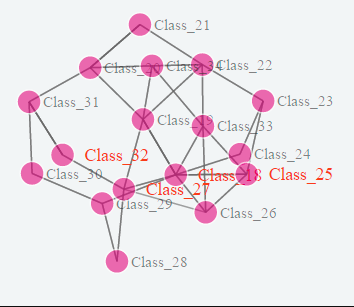

# 对象引用

### 防止循环引用

当用循环引用映射对象时，将会产生一个stackoverflow异常。这是因为Mapster会陷入一个循环，试图递归地映射循环引用。如果你想映射循环引用或保留引用(比如指向同一个对象的两个属性)，你可以通过将' preserverference '设置为' true '来实现

当映射类型存在循环引用时，会导致 Mapster 试图递归映射循环引用并抛出  **stackoverflow** 异常。

如果想要映射循环引用或保留引用(例如指向同一个对象的两个属性)，可以使用 `PreserveReference` 方法并将参数设置为 `true` 来实现这个需求：

```csharp
TypeAdapterConfig<TSource, TDestination>
    .NewConfig()
    .PreserveReference(true);
```

> 注意！ Mapster 配置的是类型到类型，而不是每个层次结构，所以在使用时需要显示配置所有类型.

> 注意！`PreserveReference` 不支持对 `ProjectTo` EF `IQueryable` 的映射 ！

### 映射深度 —— MaxDepth

对于递归映射，可以尝试使用 `MaxDepth` 方法指定映射深度，将在到达指定映射深度时停止映射。并且 `MaxDepth` 支持对 `IQueryable` 的映射。

```csharp
TypeAdapterConfig<TSource, TDestination>
    .NewConfig()
    .MaxDepth(3);
```

> 注意！
>
> * `MaxDepth` 映射深度最小应该为 1，深度为1将映射对象本身成员，不继续映射嵌套对象的成员。
> * `MaxDepth` 未限制最大深度，但不应该将深度设置太大，因为每增加一级深度就会生成一个映射逻辑，若深度过大会导致大量的内存占用。

### 浅拷贝

Mapster 默认会递归映射嵌套对象。可以通过 `ShallowCopyForSameType` 方法将参数设置为`true`来进行浅拷贝：

```csharp
TypeAdapterConfig<TSource, TDestination>
    .NewConfig()
    .ShallowCopyForSameType(true);
```

### 大对象映射

为了优化性能，Mapster 会尝试内联类映射。如果映射的模型很复杂，那么这个过程将花费很多时间。



可以通过调用 `AvoidInlineMapping` 方法跳过内联过程：

```csharp
TypeAdapterConfig.GlobalSettings.Default
    .AvoidInlineMapping(true);
```